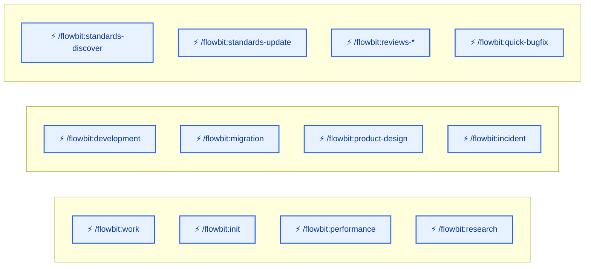
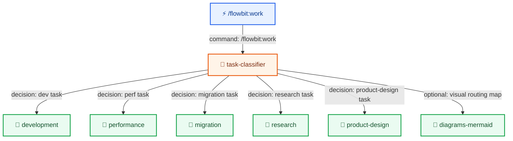
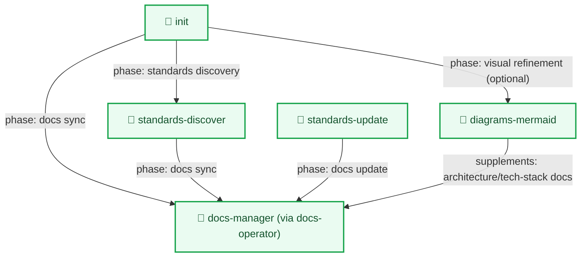
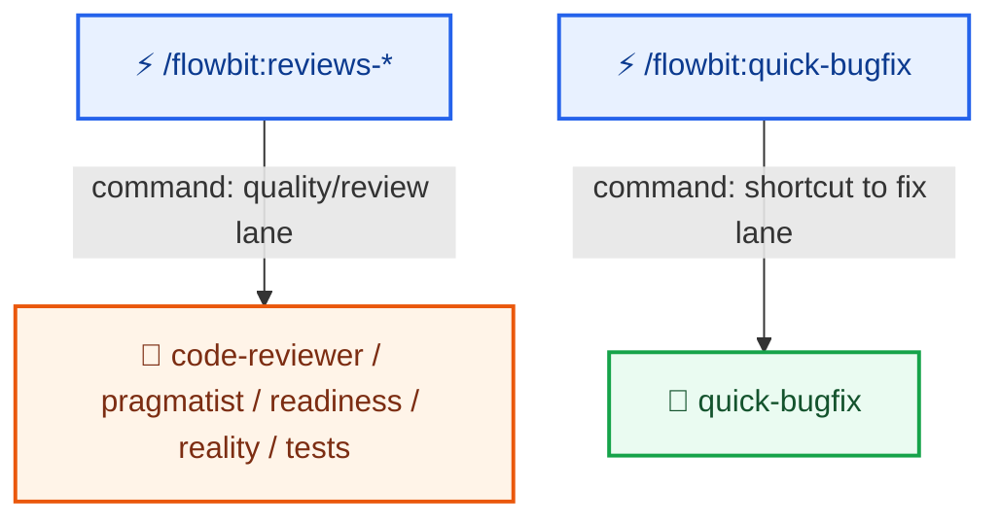
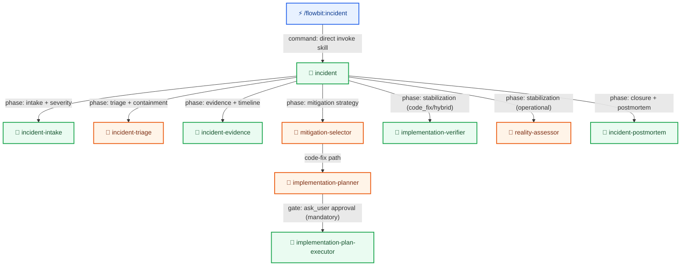

# Overview

This document breaks the overview into separate, readable diagrams and describes dependencies between sections.

## How to read these diagrams

Each diagram uses the following conventions:

| Symbol | Color | Meaning |
|--------|-------|---------|
| ⚡ | Blue | **Command** — a user-facing CLI entry point (e.g. `/flowbit:work`, `/flowbit:init`) |
| 🧠 | Green | **Skill** — an orchestration unit that manages a multi-phase workflow |
| 🤖 | Orange | **Agent** — a specialized subagent that executes a focused, bounded task |

Arrows show invocation or delegation direction. Edge labels describe the phase or decision that triggers the call.

> **Viewing diagrams:** Mermaid diagrams render natively on GitHub and in IDEs with a Mermaid extension (e.g. [Markdown Preview Mermaid Support](https://marketplace.visualstudio.com/items?itemName=bierner.markdown-mermaid) for VS Code).

## Navigation

- [Entry points](#entry-points)
- [Work routing](#work-routing)
- [Direct command to orchestrator mapping](#direct-command-to-orchestrator-mapping)
- [Init and standards flow](#init-and-standards-flow)
- [Delivery orchestrators and shared skills](#delivery-orchestrators-and-shared-skills)
- [Orchestrators to specialized agent families](#orchestrators-to-specialized-agent-families)
- [Reviews and quick bugfix bindings](#reviews-and-quick-bugfix-bindings)
- [Incident response lane](#incident-response-lane)

## Entry points

Description:
- These are all entry commands that trigger routing or orchestrators.
- `/flowbit:work` goes through [Work routing](#work-routing).
- Skill commands `/flowbit:*` map directly to orchestrators in [Direct command to orchestrator mapping](#direct-command-to-orchestrator-mapping).
- Review commands (`/flowbit:reviews-*`) and quick bugfix (`/flowbit:quick-bugfix`) have additional bindings described in [Reviews and quick bugfix bindings](#reviews-and-quick-bugfix-bindings).
- `/flowbit:incident` starts a dedicated operational lane described in [Incident response lane](#incident-response-lane).

## Work routing

Description:
- This path applies only to the `/flowbit:work` command.
- `task-classifier` decides which orchestrator to start.
- Each classification result leads to one of the flows: `development`, `performance`, `migration`, `research`, `product-design`.
- Optionally, `diagrams-mermaid` can visualize routing/resume based on confirmed state.
- Further dependencies of these flows are described in [Delivery orchestrators and shared skills](#delivery-orchestrators-and-shared-skills) and [Orchestrators to specialized agent families](#orchestrators-to-specialized-agent-families).

## Direct command to orchestrator mapping

Description:
- These commands bypass the classifier and invoke orchestrators directly.
- `/flowbit:quick-bugfix` starts `quick-bugfix` as a separate, shortened fix flow.
- `/flowbit:incident` starts `incident` as a dedicated response + postmortem flow.
- Dependencies of `init` and standards are expanded in [Init and standards flow](#init-and-standards-flow).

```mermaid
graph TD
  INIT["⚡ /flowbit:init"] -- "command: direct invoke skill" --> S_INIT["🧠 init"]
  DEV["⚡ /flowbit:development"] -- "command: direct invoke skill" --> S_DEV["🧠 development"]
  PERF["⚡ /flowbit:performance"] -- "command: direct invoke skill" --> S_PERF["🧠 performance"]
  MIG["⚡ /flowbit:migration"] -- "command: direct invoke skill" --> S_MIG["🧠 migration"]
  RES["⚡ /flowbit:research"] -- "command: direct invoke skill" --> S_RES["🧠 research"]
  PD["⚡ /flowbit:product-design"] -- "command: direct invoke skill" --> S_PD["🧠 product-design"]
  INC["⚡ /flowbit:incident"] -- "command: direct invoke skill" --> S_INC["🧠 incident"]
  STD_DISC["⚡ /flowbit:standards-discover"] -- "command: direct invoke skill" --> S_STD_DISC["🧠 standards-discover"]
  STD_UPD["⚡ /flowbit:standards-update"] -- "command: direct invoke skill" --> S_STD_UPD["🧠 standards-update"]
  QBUG["⚡ /flowbit:quick-bugfix"] -- "command: shortcut flow" --> S_QBUG["🧠 quick-bugfix"]

  classDef cmd fill:#E8F1FF,stroke:#2563EB,stroke-width:2px,color:#0B3A8F;
  classDef skill fill:#EAFBF1,stroke:#16A34A,stroke-width:2px,color:#14532D;
  class INIT,DEV,PERF,MIG,RES,PD,INC,STD_DISC,STD_UPD,QBUG cmd;
  class S_INIT,S_DEV,S_PERF,S_MIG,S_RES,S_PD,S_INC,S_STD_DISC,S_STD_UPD,S_QBUG skill;
```

## Init and standards flow

Description:
- `init` triggers standards discovery and documentation synchronization.
- Both `standards-discover` and `standards-update` end at `docs-manager (via docs-operator)`.
- `init` can call `diagrams-mermaid` to refine generated documents (e.g., architecture/tech-stack) without replacing content.
- This flow ties project setup to standards maintenance and docs.

## Delivery orchestrators and shared skills

Description:
- `development`, `performance`, `migration` share the same three capabilities: `codebase-analyzer`, `implementation-plan-executor`, `implementation-verifier`.
- These orchestrators can call `diagrams-mermaid` to refine `spec` and `implementation-plan` (diagrams as a supplement to descriptions).
- `product-design` uses the shared `codebase-analyzer`.
- `incident` uses an operational lane (`incident-intake`, `incident-evidence`, `incident-postmortem`) and delegates triage to the `incident-triage` agent. It can conditionally enter the code-fix lane (`implementation-plan-executor`, `implementation-verifier`). For operational mitigation, stabilization uses `reality-assessor` directly.
- This is the core of shared execution dependencies; agent details are in [Orchestrators to specialized agent families](#orchestrators-to-specialized-agent-families).

```mermaid
graph TD
  S_DEV["🧠 development"] -- "phase: code analysis" --> S_CODEBASE["🧠 codebase-analyzer"]
  S_DEV -- "phase: diagram refinement (spec/plan)" --> S_DIAG["🧠 diagrams-mermaid"]
  S_DEV -- "phase: plan execution" --> S_IMPL_EXEC["🧠 implementation-plan-executor"]
  S_DEV -- "phase: verification" --> S_IMPL_VER["🧠 implementation-verifier"]

  S_PERF["🧠 performance"] -- "phase: code analysis" --> S_CODEBASE
  S_PERF -- "phase: diagram refinement (spec/plan)" --> S_DIAG
  S_PERF -- "phase: plan execution" --> S_IMPL_EXEC
  S_PERF -- "phase: verification" --> S_IMPL_VER

  S_MIG["🧠 migration"] -- "phase: code analysis" --> S_CODEBASE
  S_MIG -- "phase: diagram refinement (spec/plan)" --> S_DIAG
  S_MIG -- "phase: plan execution" --> S_IMPL_EXEC
  S_MIG -- "phase: verification" --> S_IMPL_VER

  S_PD["🧠 product-design"] -- "phase: code analysis (enhancement)" --> S_CODEBASE

  S_INC["🧠 incident"] -- "phase: intake" --> S_INC_INTAKE["🧠 incident-intake"]
  S_INC -- "phase: triage" --> A_INC_TRIAGE["🤖 incident-triage"]
  S_INC -- "phase: evidence + timeline" --> S_INC_EVID["🧠 incident-evidence"]
  S_INC -- "phase: mitigation execution (conditional code-fix)" --> S_IMPL_EXEC
  S_INC -- "phase: stabilization (code_fix/hybrid)" --> S_IMPL_VER
  S_INC -- "phase: stabilization (operational)" --> A_REAL_OPS["🤖 reality-assessor"]
  S_INC -- "phase: closure + followups" --> S_INC_POST["🧠 incident-postmortem"]

  classDef skill fill:#EAFBF1,stroke:#16A34A,stroke-width:2px,color:#14532D;
  classDef agent fill:#FFF4E8,stroke:#EA580C,stroke-width:2px,color:#7C2D12;
  class S_DEV,S_CODEBASE,S_IMPL_EXEC,S_IMPL_VER,S_PERF,S_MIG,S_PD,S_DIAG,S_INC,S_INC_INTAKE,S_INC_EVID,S_INC_POST skill;
  class A_INC_TRIAGE,A_REAL_OPS agent;
```

## Orchestrators to specialized agent families

Description:
- `A_SPEC` and `A_PLAN` are the agent family for execution flows (`development`, `performance`, `migration`).
- `A_RESEARCH` handles the main research flow and supports `product-design`.
- `A_QUALITY` is triggered by `implementation-verifier` and the review command.
- `A_INCIDENT` groups operational agents for the incident lane.
- `A_OTHER` groups helper tools (analyzers, UI mockup, user docs, etc.).
- `diagrams-mermaid` is a skill capability for visualizing flows and communication based on existing content.

```mermaid
graph TD
  S_DEV["🧠 development"] -- "delegation: spec creation/audit" --> A_SPEC["🤖 specification-creator / spec-auditor"]
  S_PERF["🧠 performance"] -- "delegation: spec creation/audit" --> A_SPEC
  S_MIG["🧠 migration"] -- "delegation: spec creation/audit" --> A_SPEC

  S_DEV -- "delegation: planning/execution" --> A_PLAN["🤖 implementation-planner / task-group-implementer"]
  S_PERF -- "delegation: planning/execution" --> A_PLAN
  S_MIG -- "delegation: planning/execution" --> A_PLAN

  S_RES["🧠 research"] -- "delegation: research pipeline" --> A_RESEARCH["🤖 research-planner / gatherer / synthesizer / brainstormer / designer"]
  S_RES -- "delegation: visual refinement (design docs)" --> S_DIAG["🧠 diagrams-mermaid"]
  S_PD["🧠 product-design"] -- "delegation: mini-research support" --> A_RESEARCH

  S_IMPL_VER["🧠 implementation-verifier"] -- "quality gates" --> A_QUALITY["🤖 code-reviewer / pragmatist / readiness / reality / tests"]

  S_INC["🧠 incident"] -- "delegation: triage + blast radius" --> A_INCIDENT["🤖 incident-triage / blast-radius-analyzer / mitigation-selector / timeline-correlator / postmortem-author"]
  S_INC -- "delegation: code-fix planning/execution (conditional)" --> A_PLAN

  S_INIT["🧠 init"] -- "delegation: helper analyzers" --> A_OTHER["🤖 project-analyzer / gap-analyzer / ui-mockup / bottleneck / user-docs"]
  S_DEV -- "delegation: helper analyzers" --> A_OTHER
  S_PERF -- "delegation: helper analyzers" --> A_OTHER
  S_MIG -- "delegation: helper analyzers" --> A_OTHER
  S_INC -- "delegation: evidence gathering support" --> A_OTHER

  classDef skill fill:#EAFBF1,stroke:#16A34A,stroke-width:2px,color:#14532D;
  classDef agent fill:#FFF4E8,stroke:#EA580C,stroke-width:2px,color:#7C2D12;
  class S_DEV,S_PERF,S_MIG,S_RES,S_PD,S_IMPL_VER,S_INIT,S_INC skill;
  class A_SPEC,A_PLAN,A_RESEARCH,A_QUALITY,A_OTHER,A_INCIDENT agent;
```

## Reviews and quick bugfix bindings

Description:
- `/flowbit:reviews-*` directly invokes the quality agent family.
- `/flowbit:quick-bugfix` starts `quick-bugfix` as a fast operational path.
- This section closes the entry-point mapping from [Entry points](#entry-points).

## Incident response lane

Description:
- `/flowbit:incident` starts the operational lane outside `/flowbit:work` (no classifier changes at this stage).
- The flow is state-driven: intake -> triage -> evidence -> mitigation -> verification -> postmortem.
- For the `code_fix` path there is a hard gate: `implementation-planner` -> `ask_user` approval -> `implementation-plan-executor`.
- For `operational` mitigation, stabilization uses `reality-assessor` directly. For `code_fix`/`hybrid`, `implementation-verifier` is called.
- `incident-triage` is an agent (not a skill wrapper).

