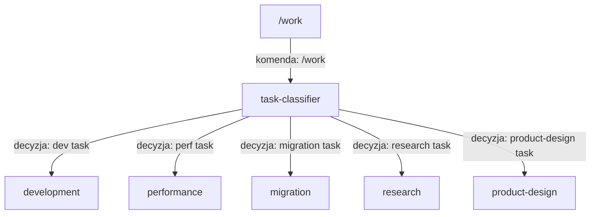
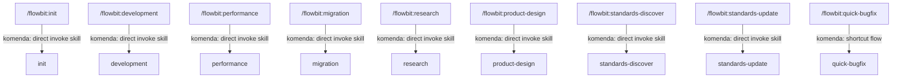
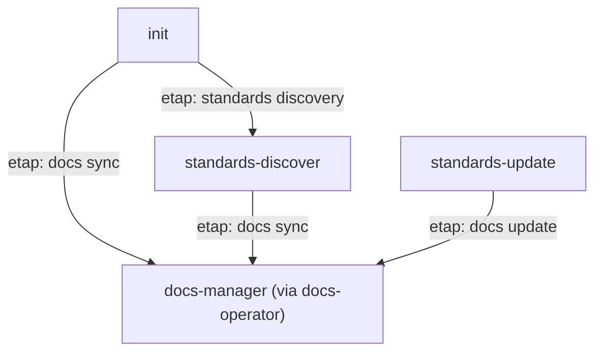
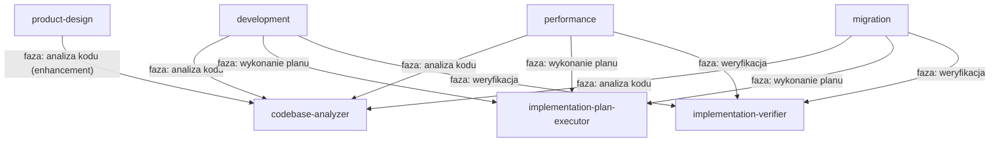
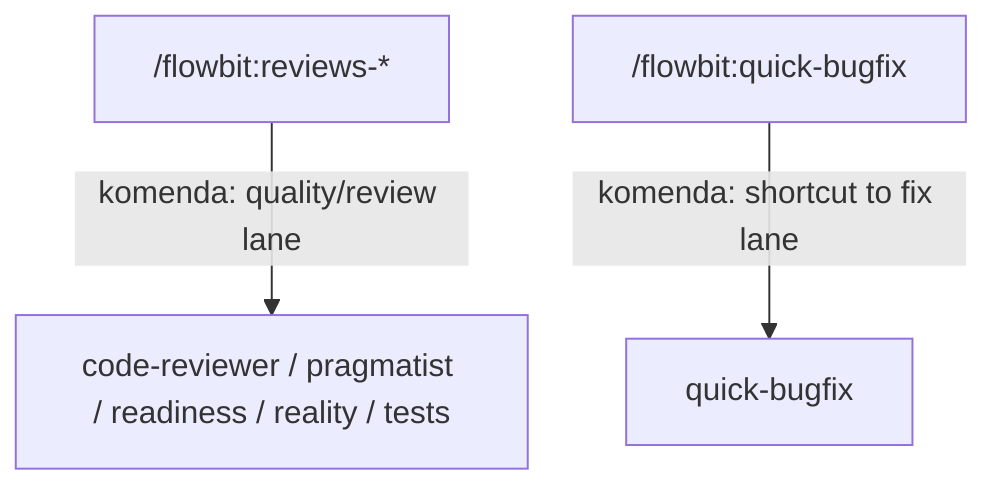

# Overview

Ten dokument rozbija overview na osobne, czytelne diagramy oraz opisuje zaleznosci miedzy sekcjami.

## Nawigacja

- [Entry points](#entry-points)
- [Work routing](#work-routing)
- [Direct command to orchestrator mapping](#direct-command-to-orchestrator-mapping)
- [Init and standards flow](#init-and-standards-flow)
- [Delivery orchestrators and shared skills](#delivery-orchestrators-and-shared-skills)
- [Orchestrators to specialized agent families](#orchestrators-to-specialized-agent-families)
- [Reviews and quick bugfix bindings](#reviews-and-quick-bugfix-bindings)

## Entry points

Opis:
- To sa wszystkie komendy wejsciowe, ktore odpalaja routing lub orchestratory.
- `/work` przechodzi przez [Work routing](#work-routing).
- Komendy skillowe `/flowbit:*` mapuja sie bezposrednio do orchestratorow w [Direct command to orchestrator mapping](#direct-command-to-orchestrator-mapping).
- Komendy review (`/flowbit:reviews-*`) i quick bugfix (`/flowbit:quick-bugfix`) maja dodatkowe powiazania opisane w [Reviews and quick bugfix bindings](#reviews-and-quick-bugfix-bindings).

```mermaid
graph TD
  WORK["/work"]
  INIT["/flowbit:init"]
  DEV["/flowbit:development"]
  PERF["/flowbit:performance"]
  MIG["/flowbit:migration"]
  RES["/flowbit:research"]
  PD["/flowbit:product-design"]
  STD_DISC["/flowbit:standards-discover"]
  STD_UPD["/flowbit:standards-update"]
  REV["/flowbit:reviews-*"]
  QBUG["/flowbit:quick-bugfix"]
```

## Work routing

Opis:
- Sciezka dotyczy tylko komendy `/work`.
- `task-classifier` decyduje, ktory orchestrator uruchomic.
- Kazdy wynik klasyfikacji prowadzi do jednego z flow: `development`, `performance`, `migration`, `research`, `product-design`.
- Dalsze zaleznosci tych flow sa opisane w [Delivery orchestrators and shared skills](#delivery-orchestrators-and-shared-skills) oraz [Orchestrators to specialized agent families](#orchestrators-to-specialized-agent-families).

## Direct command to orchestrator mapping

Opis:
- Te komendy omijaja klasyfikator i uruchamiaja orchestratory bezposrednio.
- `/flowbit:quick-bugfix` uruchamia `quick-bugfix` jako osobny, skrocony flow naprawczy.
- Zaleznosci `init` i standardow sa rozszerzone w [Init and standards flow](#init-and-standards-flow).

## Init and standards flow

Opis:
- `init` uruchamia discovery standardow oraz synchronizacje dokumentacji.
- Zarowno `standards-discover`, jak i `standards-update` koncza w `docs-manager (via docs-operator)`.
- Ten flow spina setup projektu z utrzymaniem standardow i docs.

## Delivery orchestrators and shared skills

Opis:
- `development`, `performance`, `migration` wspoldziela te same trzy capability: `codebase-analyzer`, `implementation-plan-executor`, `implementation-verifier`.
- `product-design` uzywa wspolnego `codebase-analyzer`.
- To jest trzon wspolnych zaleznosci wykonawczych; szczegoly agentowe sa w [Orchestrators to specialized agent families](#orchestrators-to-specialized-agent-families).

## Orchestrators to specialized agent families

Opis:
- `A_SPEC` i `A_PLAN` sa rodzina agentow dla flow wykonawczych (`development`, `performance`, `migration`).
- `A_RESEARCH` obsluguje glowne flow badawcze i wspiera `product-design`.
- `A_QUALITY` jest uruchamiane przez `implementation-verifier` i review command.
- `A_OTHER` grupuje narzedzia pomocnicze (analyzery, UI mockup, user docs itp.).

```mermaid
graph TD
  S_DEV["development"] -- "delegacja: spec creation/audit" --> A_SPEC["specification-creator / spec-auditor"]
  S_PERF["performance"] -- "delegacja: spec creation/audit" --> A_SPEC
  S_MIG["migration"] -- "delegacja: spec creation/audit" --> A_SPEC

  S_DEV -- "delegacja: planning/execution" --> A_PLAN["implementation-planner / task-group-implementer"]
  S_PERF -- "delegacja: planning/execution" --> A_PLAN
  S_MIG -- "delegacja: planning/execution" --> A_PLAN

  S_RES["research"] -- "delegacja: research pipeline" --> A_RESEARCH["research-planner / gatherer / synthesizer / brainstormer / designer"]
  S_PD["product-design"] -- "delegacja: mini-research support" --> A_RESEARCH

  S_IMPL_VER["implementation-verifier"] -- "quality gates" --> A_QUALITY["code-reviewer / pragmatist / readiness / reality / tests"]

  S_INIT["init"] -- "delegacja: helper analyzers" --> A_OTHER["project-analyzer / gap-analyzer / ui-mockup / bottleneck / user-docs"]
  S_DEV -- "delegacja: helper analyzers" --> A_OTHER
  S_PERF -- "delegacja: helper analyzers" --> A_OTHER
  S_MIG -- "delegacja: helper analyzers" --> A_OTHER
```

## Reviews and quick bugfix bindings

Opis:
- `/flowbit:reviews-*` uruchamia bezposrednio rodzine quality agentow.
- `/flowbit:quick-bugfix` uruchamia `quick-bugfix` jako szybka sciezka operacyjna.
- Ta sekcja domyka mapowanie entry-pointow z [Entry points](#entry-points).

