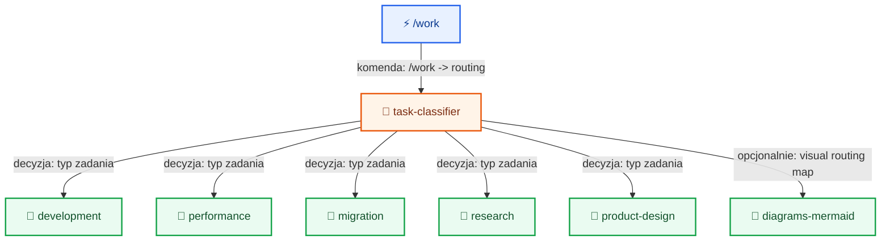
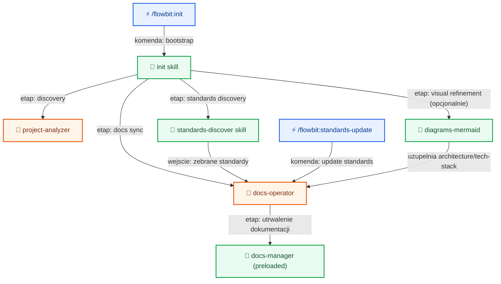
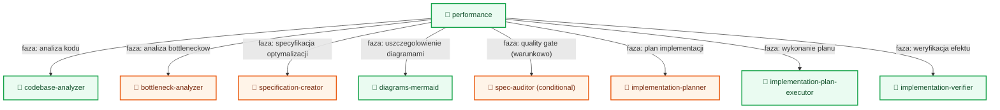
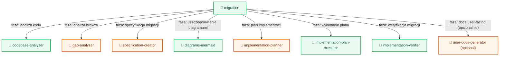
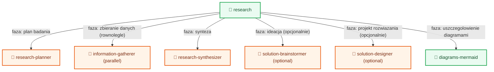
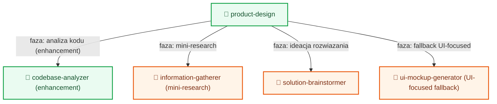
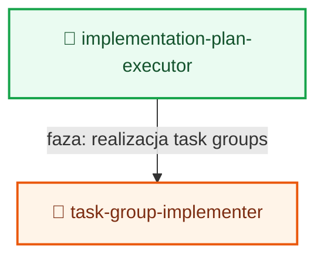
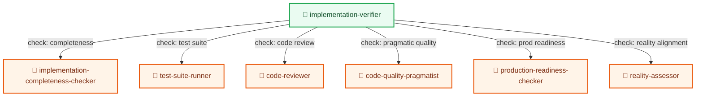

# Workflows

Ten dokument pokazuje workflow jako osobne diagramy oraz opisuje zaleznosci miedzy nimi.

## Nawigacja

- [Work routing](#work-routing)
- [Init + standards](#init-standards)
- [Development](#development)
- [Performance](#performance)
- [Migration](#migration)
- [Research](#research)
- [Product design](#product-design)
- [Shared internals: codebase-analyzer](#shared-codebase-analyzer)
- [Shared internals: implementation executor](#shared-implementation-executor)
- [Shared internals: implementation verifier](#shared-implementation-verifier)

## Work routing

Opis:
- Wejscie przez komende `/work` trafia do `task-classifier`.
- `task-classifier` wybiera jedna z 5 sciezek: [Development](#development), [Performance](#performance), [Migration](#migration), [Research](#research), [Product design](#product-design).
- Opcjonalnie `diagrams-mermaid` moze wygenerowac mape routingu/resume dla biezacego zadania.
- Ten diagram jest punktem startowym calego flow.

## Init + standards

Opis:
- Komenda `/flowbit:init` uruchamia `init skill`.
- `init skill` odpala analize projektu i odkrywanie standardow.
- `init skill` moze wywolac `diagrams-mermaid`, aby uszczegolowic dokumenty `architecture` i `tech-stack` bez zastapienia opisu.
- `docs-operator` agreguje standardy i aktualizuje [docs-manager](#shared-codebase-analyzer) (powiazanie przez wspolne wewnetrzne capability opisu i raportowania).
- Komenda `/flowbit:standards-update` pozwala dograc standardy poza init.

## Development

Opis:
- Sciezka aktywowana przez [Work routing](#work-routing), gdy klasyfikator zwroci `development`.
- Wykorzystuje wspolne komponenty z [Shared internals: codebase-analyzer](#shared-codebase-analyzer), [Shared internals: implementation executor](#shared-implementation-executor) i [Shared internals: implementation verifier](#shared-implementation-verifier).
- Moze uszczegolawiac `spec.md` i `implementation-plan.md` przez `diagrams-mermaid` (diagramy jako dopelnienie tekstu).
- Opcjonalne galezie (`ui-mockup`, `e2e-test-verifier`, `user-docs-generator`) sa zalezne od typu zmian i kryteriow akceptacji.

```mermaid
graph TD
  DEV2["🧠 development"] -- "faza: analiza kodu" --> CODEBASE_D["🧠 codebase-analyzer"]
  DEV2 -- "faza: analiza brakow" --> GAP_D["🤖 gap-analyzer"]
  DEV2 -- "faza: specyfikacja" --> SPEC_D["🤖 specification-creator"]
  DEV2 -- "faza: uszczegolowienie diagramami" --> DIAG_D["🧠 diagrams-mermaid"]
  DEV2 -- "faza: quality gate (warunkowo)" --> AUD_D["🤖 spec-auditor (conditional)"]
  DEV2 -- "faza: plan implementacji" --> PLAN_D["🤖 implementation-planner"]
  DEV2 -- "faza: wykonanie planu" --> EXEC_D["🧠 implementation-plan-executor"]
  DEV2 -- "faza: weryfikacja" --> VER_D["🧠 implementation-verifier"]
  DEV2 -- "faza: UI (jesli ui_heavy)" --> UI_D["🤖 ui-mockup (if ui_heavy)"]
  DEV2 -- "faza: testy E2E (opcjonalnie)" --> E2E_D["🤖 e2e-test-verifier (optional)"]
  DEV2 -- "faza: docs user-facing (opcjonalnie)" --> UDOCS_D["🤖 user-docs-generator (optional)"]

  classDef skill fill:#EAFBF1,stroke:#16A34A,stroke-width:2px,color:#14532D;
  classDef agent fill:#FFF4E8,stroke:#EA580C,stroke-width:2px,color:#7C2D12;
  class DEV2,CODEBASE_D,EXEC_D,VER_D,DIAG_D skill;
  class GAP_D,SPEC_D,AUD_D,PLAN_D,UI_D,E2E_D,UDOCS_D agent;
```

## Performance

Opis:
- Sciezka aktywowana przez [Work routing](#work-routing), gdy klasyfikator zwroci `performance`.
- Rozszerza flow o `bottleneck-analyzer`, ale dalej korzysta z [Shared internals: implementation executor](#shared-implementation-executor) i [Shared internals: implementation verifier](#shared-implementation-verifier).
- Moze dodac warstwe wizualna planu/spec przez `diagrams-mermaid`.

## Migration

Opis:
- Sciezka aktywowana przez [Work routing](#work-routing), gdy klasyfikator zwroci `migration`.
- Podobna do [Development](#development), ale nacisk jest na domkniecie migracji i ewentualny output dokumentacyjny dla usera.
- Moze uszczegolowic plan migracji przez `diagrams-mermaid`.

## Research

Opis:
- Sciezka aktywowana przez [Work routing](#work-routing), gdy klasyfikator zwroci `research`.
- To flow badawcze, ktore moze zasilic [Product design](#product-design) lub [Development](#development) wynikami.
- W fazie design moze wywolac `diagrams-mermaid`, zeby doprecyzowac `high-level-design.md`.

## Product design

Opis:
- Sciezka aktywowana przez [Work routing](#work-routing), gdy klasyfikator zwroci `product-design`.
- Lacznik miedzy mini-research a konceptem UI; moze konsumowac wyniki z [Research](#research).
- Korzysta tez z elementow analizy kodu jak w [Shared internals: codebase-analyzer](#shared-codebase-analyzer).

## Shared internals: codebase-analyzer

Opis:
- Ten wewnetrzny flow jest wspolny dla [Development](#development), [Performance](#performance), [Migration](#migration) i [Product design](#product-design).
- `Explore agents` realizuja etap eksploracji kodu, a `codebase-analysis-reporter` domyka raport.

## Shared internals: implementation executor

Opis:
- Ten fragment jest wspolny dla flow wykonawczych: [Development](#development), [Performance](#performance), [Migration](#migration).
- `implementation-plan-executor` deleguje wykonanie do `task-group-implementer`.

## Shared internals: implementation verifier

Opis:
- Ten fragment jest wspolny dla flow wykonawczych: [Development](#development), [Performance](#performance), [Migration](#migration).
- `implementation-verifier` uruchamia wiele quality gates i raportuje gotowosc produkcyjna.

