# Workflows

This document shows each workflow as a separate diagram and describes dependencies between them.

## Navigation

- [Work routing](#work-routing)
- [Init + standards](#init-standards)
- [Development](#development)
- [Performance](#performance)
- [Migration](#migration)
- [Research](#research)
- [Product design](#product-design)
- [Incident](#incident)
- [Shared internals: codebase-analyzer](#shared-codebase-analyzer)
- [Shared internals: implementation executor](#shared-implementation-executor)
- [Shared internals: implementation verifier](#shared-implementation-verifier)

## Work routing

Description:
- Entry via the `/flowbit:work` command goes to `task-classifier`.
- `task-classifier` selects one of 5 paths: [Development](#development), [Performance](#performance), [Migration](#migration), [Research](#research), [Product design](#product-design).
- The `incident` lane is triggered directly by `/flowbit:incident` (no `/flowbit:work` routing changes at this stage).
- Optionally, `diagrams-mermaid` can generate a routing/resume map for the current task.
- This diagram is the starting point of the entire flow.

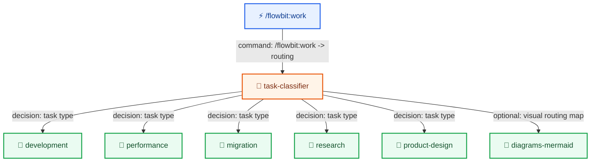

## Init + standards

Description:
- The `/flowbit:spec-init` command starts the `spec-init skill`.
- `spec-init skill` triggers project analysis and standards discovery.
- `spec-init skill` can call `diagrams-mermaid` to refine `architecture` and `tech-stack` documents without replacing their descriptions.
- `docs-operator` aggregates standards and updates `docs-manager`.
- The `/flowbit:standards-update` command allows updating standards outside of spec-init.

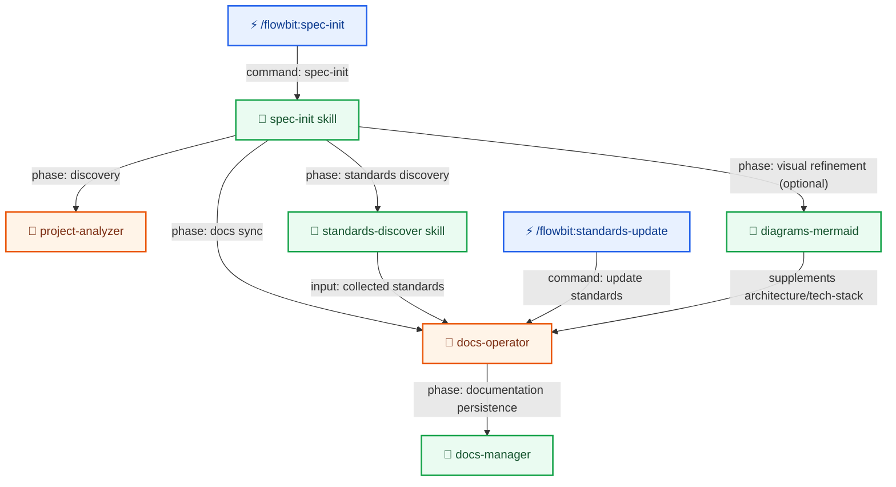

## Development

Description:
- Path activated by [Work routing](#work-routing) when the classifier returns `development`.
- Uses shared components from [Shared internals: codebase-analyzer](#shared-codebase-analyzer), [Shared internals: implementation executor](#shared-implementation-executor) and [Shared internals: implementation verifier](#shared-implementation-verifier).
- Can refine `spec.md` and `implementation-plan.md` via `diagrams-mermaid` (diagrams as a complement to text).
- Optional branches (`ui-mockup`, `e2e-test-verifier`, `user-docs-generator`) depend on the type of changes and acceptance criteria.

```mermaid
graph TD
  DEV2["🧠 development"] -- "phase: code analysis" --> CODEBASE_D["🧠 codebase-analyzer"]
  DEV2 -- "phase: gap analysis" --> GAP_D["🤖 gap-analyzer"]
  DEV2 -- "phase: specification" --> SPEC_D["🤖 specification-creator"]
  DEV2 -- "phase: diagram refinement" --> DIAG_D["🧠 diagrams-mermaid"]
  DEV2 -- "phase: quality gate (conditional)" --> AUD_D["🤖 spec-auditor (conditional)"]
  DEV2 -- "phase: implementation plan" --> PLAN_D["🤖 implementation-planner"]
  DEV2 -- "phase: plan execution" --> EXEC_D["🧠 implementation-plan-executor"]
  DEV2 -- "phase: verification" --> VER_D["🧠 implementation-verifier"]
  DEV2 -- "phase: UI (if ui_heavy)" --> UI_D["🤖 ui-mockup (if ui_heavy)"]
  DEV2 -- "phase: E2E tests (optional)" --> E2E_D["🤖 e2e-test-verifier (optional)"]
  DEV2 -- "phase: user-facing docs (optional)" --> UDOCS_D["🤖 user-docs-generator (optional)"]

  classDef skill fill:#EAFBF1,stroke:#16A34A,stroke-width:2px,color:#14532D;
  classDef agent fill:#FFF4E8,stroke:#EA580C,stroke-width:2px,color:#7C2D12;
  class DEV2,CODEBASE_D,EXEC_D,VER_D,DIAG_D skill;
  class GAP_D,SPEC_D,AUD_D,PLAN_D,UI_D,E2E_D,UDOCS_D agent;
```

## Performance

Description:
- Path activated by [Work routing](#work-routing) when the classifier returns `performance`.
- Extends the flow with `bottleneck-analyzer`, but still uses [Shared internals: implementation executor](#shared-implementation-executor) and [Shared internals: implementation verifier](#shared-implementation-verifier).
- Can add a visual layer to the plan/spec via `diagrams-mermaid`.

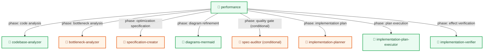

## Migration

Description:
- Path activated by [Work routing](#work-routing) when the classifier returns `migration`.
- Similar to [Development](#development), but the focus is on completing the migration and optionally producing user-facing documentation.
- Can refine the migration plan via `diagrams-mermaid`.

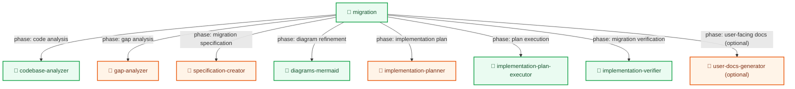

## Research

Description:
- Path activated by [Work routing](#work-routing) when the classifier returns `research`.
- This is a research flow that can feed [Product design](#product-design) or [Development](#development) with its findings.
- In the design phase, it can call `diagrams-mermaid` to refine `high-level-design.md`.

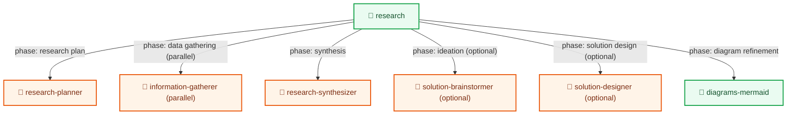

## Product design

Description:
- Path activated by [Work routing](#work-routing) when the classifier returns `product-design`.
- Bridge between mini-research and UI concept; can consume results from [Research](#research).
- Also uses code analysis elements as in [Shared internals: codebase-analyzer](#shared-codebase-analyzer).

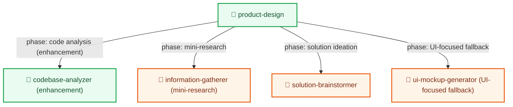

## Incident

Description:
- Path activated directly by the `/flowbit:incident` command.
- This is an operational flow: intake, triage, evidence, mitigation, verification, and postmortem.
- For `code_fix`, it reuses `implementation-planner` and `implementation-plan-executor`.
- A hard `ask_user` gate (approve / revise / stop) is required before running the executor.
- For `operational` mitigation, stabilization uses `reality-assessor` directly. For `code_fix`/`hybrid`, `implementation-verifier` is called.
- `incident-triage` is an agent (not a skill wrapper).

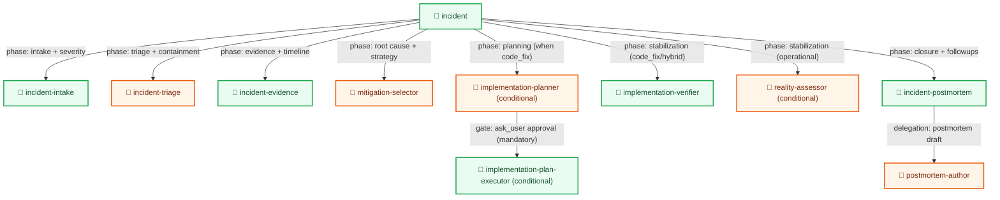

## Shared internals: codebase-analyzer

Description:
- This internal flow is shared by [Development](#development), [Performance](#performance), [Migration](#migration), and [Product design](#product-design).
- `Explore agents` handle the code exploration phase, and `codebase-analysis-reporter` closes the report.

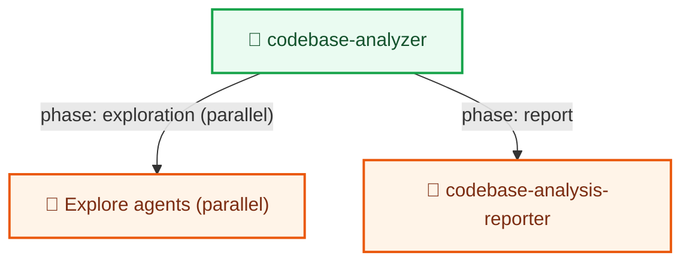

## Shared internals: implementation executor

Description:
- This fragment is shared by execution flows: [Development](#development), [Performance](#performance), [Migration](#migration).
- In [Incident](#incident) it is triggered conditionally when the mitigation path requires a `code_fix`.
- `implementation-plan-executor` delegates execution to `task-group-implementer`.

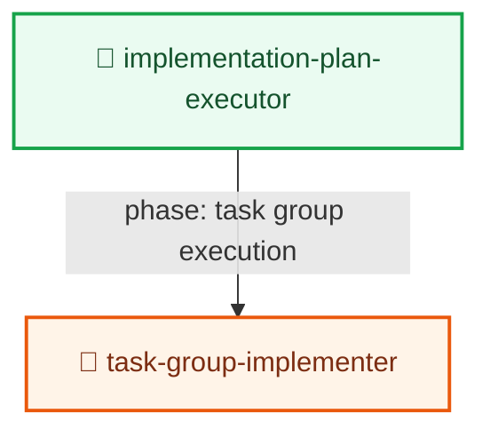

## Shared internals: implementation verifier

Description:
- This fragment is shared by execution flows: [Development](#development), [Performance](#performance), [Migration](#migration).
- In [Incident](#incident) it serves as a stabilization quality gate after mitigation execution.
- `implementation-verifier` runs multiple quality gates and reports production readiness.

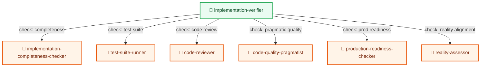
