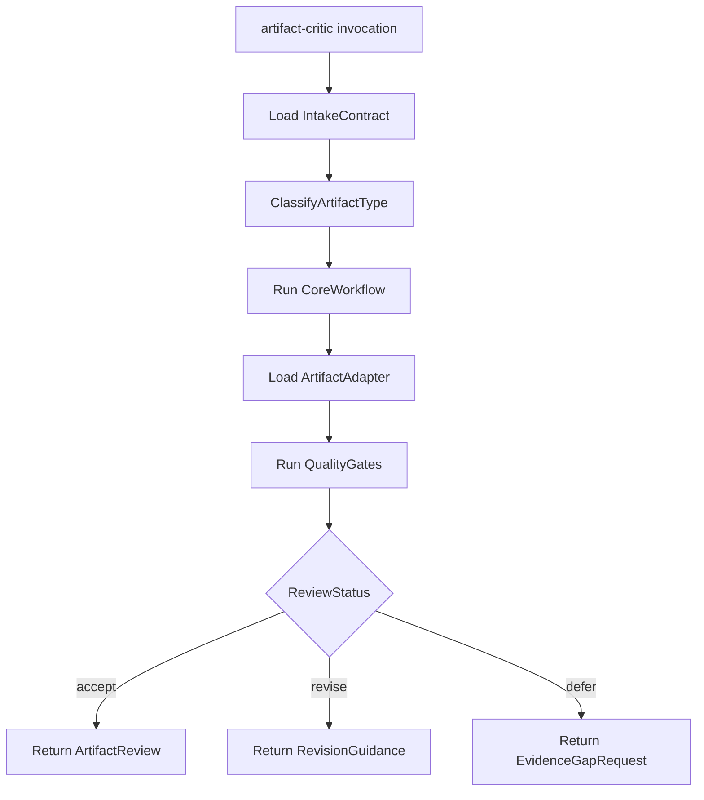

# Artifact Critic

Reusable, manual-entry critic for decision artifacts.
This skill is intentionally modular: core behavior stays stable, while artifact-specific logic lives in adapter references.

## When to use

Use this skill when you want to challenge an artifact before:
- approving a decision,
- executing implementation,
- finalizing a workflow output.

Typical prompts:
- "Critique this artifact"
- "Challenge this plan"
- "Review risks and alternatives"
- "Play devil's advocate for this workflow"

## When NOT to use

Do not run this skill for:
- trivial low-risk edits where a review loop adds no value,
- tasks that already require immediate execution with no decision gate,
- empty context where no artifact details are provided.

## Supported artifacts

Use one of these `artifactType` values:
- `diagram`
- `plan`
- `workflow`
- `architecture`
- `idea`
- `skill-definition`
- `review-report`
- `other` (fallback)

For each type, load the matching adapter file from:
- `references/adapters/`

## Execution contract

1. Read [intake contract](references/intake-contract.md).
2. Run [core workflow](references/core-workflow.md).
3. Load adapter for `artifactType` from `references/adapters/`.
4. Validate with [quality gates](references/quality-gates.md).
5. Format output with [output contract](references/output-contract.md).

For sample payloads, see [usage examples](references/examples.md).

## Flow diagram

## Mode selection

- **Quick mode** (`mode=quick`): 5-8 bullets with recommendation.
- **Deep mode** (`mode=deep`): full structured review.

Default to `quick`, unless the artifact is high risk, high impact, or ambiguous.

## Extending with new artifacts

To add a new artifact type:
1. Create `references/adapters/<new-type>.md`.
2. Add `<new-type>` to the supported artifact list in this file.
3. Add `<new-type>` to the accepted enum in `references/intake-contract.md`.

Do not change core workflow unless the critique model itself changes.
