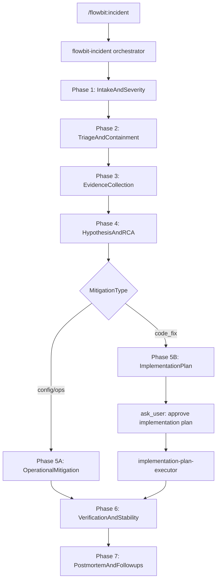

# Incident Orchestrator

Run this workflow for active production incidents, SEV events, major regressions, and high-risk operational failures.

## Initialization

### Step 1: Load framework patterns

Read:

1. `../orchestrator-framework/references/orchestrator-patterns.md`

### Step 2: Parse input and resume detection

Accept either:

- incident description (`/flowbit:incident "SEV-1 ..."`),
- or resume path (`.flowbit/tasks/incidents/YYYY-MM-DD-incident-slug`).

If resume path includes `orchestrator-state.yml`, restore state and continue from the next incomplete phase.

### Step 3: Initialize workflow

1. Create phase task items via `TaskCreate` and link dependencies using `TaskUpdate addBlockedBy`.
2. Create task directory: `.flowbit/tasks/incidents/YYYY-MM-DD-incident-slug/`.
3. Initialize `orchestrator-state.yml` with incident context and options.
4. Ensure required folders exist: `analysis/`, `implementation/`, `verification/`, `documentation/`.

---

## When to use

Use for:

- production outage or service degradation,
- elevated error rate or latency regressions,
- incidents requiring mitigations, rollback decisions, and structured follow-up.

Do not use for:

- routine feature implementation without active incident pressure (use `/flowbit:work` or `/flowbit:development`),
- small local bug fixes with no incident workflow needs (use `/flowbit:quick-bugfix`).

---

## Phase configuration

| Phase | content | activeForm | Activation |
|-------|---------|------------|------------|
| 1 | "Intake and severity assessment" | "Assessing incident severity" | Always |
| 2 | "Triage and containment decision" | "Triaging and deciding containment" | Always |
| 3 | "Evidence collection and timeline correlation" | "Collecting incident evidence" | Always |
| 4 | "Root cause hypotheses and mitigation strategy" | "Analyzing root cause hypotheses" | Always |
| 5 | "Mitigation planning and execution" | "Mitigating incident" | Always |
| 6 | "Verification and stabilization checks" | "Verifying stabilization" | Always |
| 7 | "Postmortem and follow-up actions" | "Authoring postmortem and follow-ups" | Always |
| 8 | "Finalize incident workflow" | "Finalizing incident workflow" | Always |

---

## Flow diagram



---

## Workflow phases

### Phase 1: Intake and severity assessment

**Purpose**: Normalize incident brief, classify severity, define initial impact.

**Execute**:
1. Skill tool - `flowbit-incident-intake`
2. Persist:
   - `analysis/incident-brief.md`
   - `analysis/impact-assessment.md`
3. Update state:
   - `incident_context.severity`
   - `incident_context.impact_summary`
   - `incident_context.incident_status = "active"`

**Output**: `analysis/incident-brief.md`, `analysis/impact-assessment.md`

→ **Pause**

ask_user: show severity + impact summary and ask:
- "Continue to triage and containment?"

---

### Phase 2: Triage and containment decision

**Purpose**: Decide immediate operational posture (contain now vs continue diagnosis).

**Execute**:
1. Skill tool - `flowbit-incident-triage`
2. Persist triage result in `analysis/triage-decision.md`
3. If triage proposes rollback, hot disable, or risk-heavy containment, require explicit `ask_user` confirmation before execution.
4. Update state:
   - `incident_context.containment_strategy`
   - `incident_context.current_status`
   - `incident_context.blast_radius`

**Output**: `analysis/triage-decision.md`

→ **Pause**

ask_user:
- "Apply recommended containment now" / "Proceed without containment" / "Stop and investigate manually"

---

### Phase 3: Evidence collection and timeline correlation

**Purpose**: Build evidence pack and timeline before selecting mitigation path.

**Execute**:
1. Skill tool - `flowbit-incident-evidence`
2. Ensure artifacts exist:
   - `analysis/evidence-pack.md`
   - `analysis/timeline.md`
3. Update state:
   - `incident_context.evidence_collected = true`
   - `incident_context.timeline_ready = true`

**Output**: `analysis/evidence-pack.md`, `analysis/timeline.md`

→ **Pause**

ask_user:
- "Evidence collection complete. Continue to hypothesis and mitigation strategy?"

---

### Phase 4: Root cause hypotheses and mitigation strategy

**Purpose**: Convert evidence into ranked hypotheses and decide mitigation type.

**Execute**:
1. Task tool - `flowbit-gap-analyzer` (focused on mismatch symptoms vs expected behavior)
2. Task tool - `flowbit-mitigation-selector` (incident-specific options ranking)
3. Save:
   - `analysis/hypotheses.md`
   - `implementation/mitigation-plan.md`
4. Set `incident_context.mitigation_type`:
   - `operational` (config/flags/rollback),
   - `code_fix`,
   - `hybrid`.

**Output**: `analysis/hypotheses.md`, `implementation/mitigation-plan.md`

→ **Pause**

ask_user:
- "Approve mitigation strategy?" options:
  - "Proceed with operational mitigation"
  - "Proceed with code-fix mitigation"
  - "Use hybrid approach"
  - "Revise mitigation plan"
  - "Stop"

---

### Phase 5: Mitigation planning and execution

**Purpose**: Execute approved mitigation path.

**Execute**:

#### Branch A: operational/hybrid operations part
1. Apply approved operational actions (feature flag, config rollback, traffic shaping, etc.).
2. Log all actions in `implementation/execution-log.md`.

#### Branch B: code_fix or hybrid code part
1. Task tool - `flowbit-implementation-planner` to generate `implementation/implementation-plan.md`.
2. Present concise plan summary to user.
3. **MANDATORY GATE**: ask_user with options:
   - "Approve and execute plan"
   - "Revise implementation plan"
   - "Stop incident workflow"
4. Invoke `flowbit-implementation-plan-executor` **only if user explicitly approves**.
5. Append implementation activity to `implementation/execution-log.md`.

**Critical rule**: Never invoke `flowbit-implementation-plan-executor` before explicit approval in Step 3.

**Output**: `implementation/implementation-plan.md` (when code fix), `implementation/execution-log.md`

→ **Pause**

ask_user:
- "Mitigation execution finished. Continue to verification?"

---

### Phase 6: Verification and stabilization checks

**Purpose**: Validate incident is mitigated and service is stable.

**Execute**:
1. Skill tool - `flowbit-implementation-verifier`
2. Task tool - `flowbit-reality-assessor`
3. Save:
   - `verification/incident-verification.md`
4. Update state:
   - `incident_context.verified_at`
   - `incident_context.current_status = "stabilized"` when checks pass.

**Output**: `verification/incident-verification.md`

→ **Pause**

ask_user:
- "Verification complete. Continue to postmortem?"

---

### Phase 7: Postmortem and follow-up actions

**Purpose**: Create structured postmortem and actionable next steps.

**Execute**:
1. Skill tool - `flowbit-incident-postmortem`
2. Ensure outputs:
   - `documentation/postmortem.md`
   - `documentation/followups.md`
3. Update state:
   - `incident_context.postmortem_status = "completed"`
   - `incident_context.followup_count`

**Output**: `documentation/postmortem.md`, `documentation/followups.md`

→ **Pause**

ask_user:
- "Postmortem complete. Finalize incident workflow?"

---

### Phase 8: Finalization

**Purpose**: Close incident workflow with clear handoff.

**Execute**:
1. Summarize incident lifecycle:
   - severity,
   - mitigation path,
   - verification result,
   - follow-up actions.
2. Mark state:
   - `task.status = "completed"`
   - `incident_context.incident_status = "closed"`
3. Recommend next action:
   - open follow-up dev/perf tasks as needed.

→ End of workflow

---

## Domain context (state extensions)

```yaml
orchestrator:
  options:
    code_fix_enabled: null
    allow_operational_mitigation: true
    allow_rollback: true
    require_plan_approval: true
  incident_context:
    severity: null
    impact_summary: null
    blast_radius: null
    incident_status: active
    current_status: triage
    containment_strategy: null
    mitigation_type: null
    evidence_collected: false
    timeline_ready: false
    verified_at: null
    postmortem_status: pending
    followup_count: 0
```

---

## Task structure

```text
.flowbit/tasks/incidents/YYYY-MM-DD-incident-slug/
├── orchestrator-state.yml
├── analysis/
│   ├── incident-brief.md
│   ├── impact-assessment.md
│   ├── triage-decision.md
│   ├── evidence-pack.md
│   ├── timeline.md
│   └── hypotheses.md
├── implementation/
│   ├── mitigation-plan.md
│   ├── implementation-plan.md          # conditional, when code_fix/hybrid
│   └── execution-log.md
├── verification/
│   └── incident-verification.md
└── documentation/
    ├── postmortem.md
    └── followups.md
```

---

## Command integration

Invoked via:

- `/flowbit:incident [description]`
- `/flowbit:incident [task-path] --from=PHASE` (resume)

---

## Safety rules

1. Never auto-rollback. Use explicit `ask_user` confirmation.
2. Never execute implementation plan before user approval.
3. Never mark phase completed before the phase gate decision is recorded.
4. Preserve evidence and timeline artifacts for postmortem traceability.
