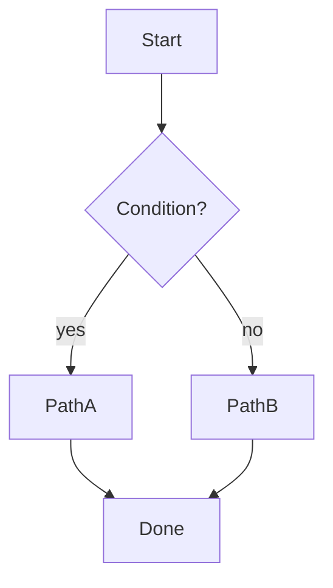
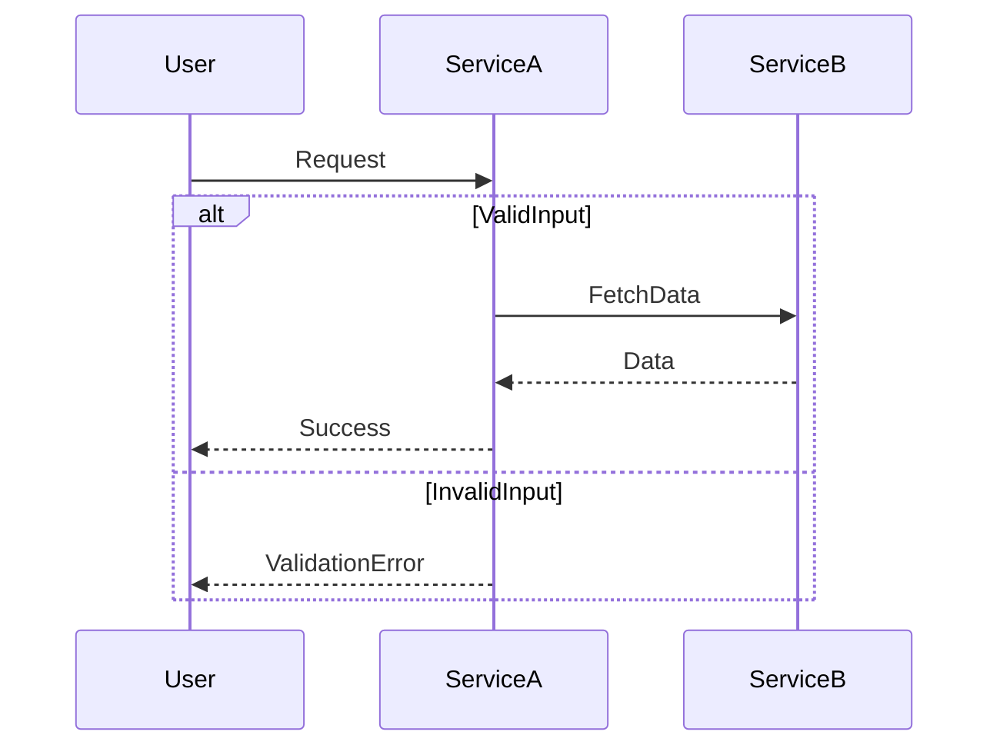
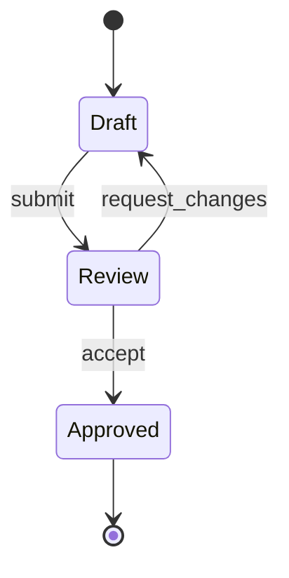
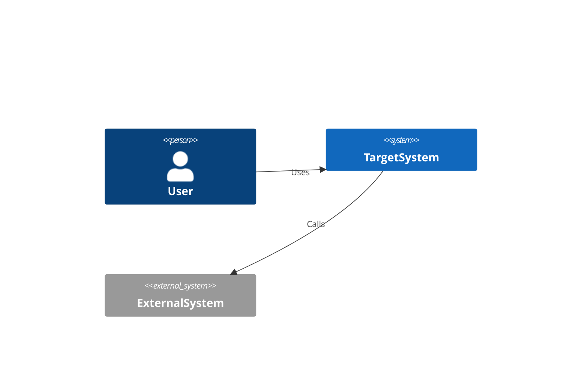
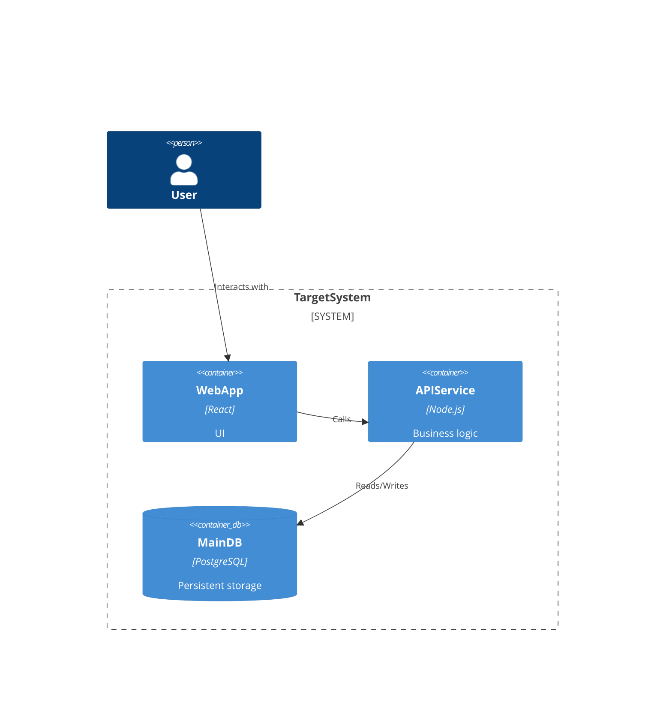

# Mermaid Diagram Reference

Quick reference for selecting and writing diagrams in planning workflows.

Hard rule for output artifacts:
- Every diagram must be emitted only in fenced ` ```mermaid ` blocks.
- Any other fenced diagram format (for example ` ```c4plantuml ` or ` ```plantuml `) is not allowed.

## Quick Type Selector

```mermaid
flowchart TD
  inputTask[TaskContext] --> needTime{NeedTimeOrder}
  needTime -->|yes| seq[sequenceDiagram]
  needTime -->|no| needState{NeedStateTransitions}
  needState -->|yes| state[stateDiagram-v2]
  needState -->|no| needArch{NeedArchitectureView}
  needArch -->|yes| c4level{RequiredC4Level}
  c4level -->|system| c4context[C4Context]
  c4level -->|service| c4container[C4Container]
  c4level -->|module| c4component[C4Component]
  needArch -->|no| flow[flowchart]
```

## Minimal Templates

### flowchart



### sequenceDiagram



### stateDiagram-v2



### C4Context



### C4Container



## Anti-Patterns

1. **Domain hallucination (critical)**  
   Adding systems/components not present in supplied context.

2. **Abstraction mixing**  
   Example: C4 context and function-level call chain in one chart.

3. **Unbounded complexity**  
   One giant diagram instead of split views.

4. **Ambiguous naming**  
   Non-semantic IDs (`A`, `B`, `step1`) without readable labels.

5. **Sequence misuse**  
   Interaction diagram without meaningful order/branches.

6. **Non-Mermaid fenced output (hard failure)**  
   Emitting any diagram in a non-`mermaid` fenced block.

## "Bad -> Better" Examples

### Inventing missing context

Bad:
- "Assume we also have Kafka and Redis" (not provided by user/context)

Better:
- "Current context is missing messaging/storage components. Please confirm whether any queue/cache exists."

### Mixed detail levels

Bad:
- One diagram contains external systems, services, and method-level internals.

Better:
- Diagram 1: C4 context/container; Diagram 2: sequence for one critical interaction.

## Parser Safety Notes

- Use quoted labels for text with special characters.
- Avoid fragile IDs and reserved keywords.
- Prefer clear ASCII names for IDs.
- Keep one diagram focused on one communication concern.

## Integration Candidates

- `src/skills/init/SKILL.md`
- `src/skills/init/references/architecture-template.md`
- `src/skills/work/SKILL.md`
- `src/skills/orchestrator-framework/references/orchestrator-patterns.md`

Not targeted:
- `docs/flow/overview.md`
- `docs/flow/workflows.md`
